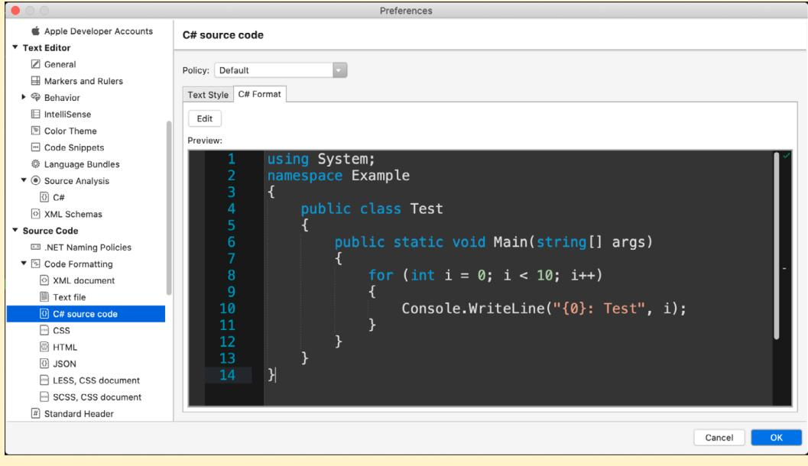
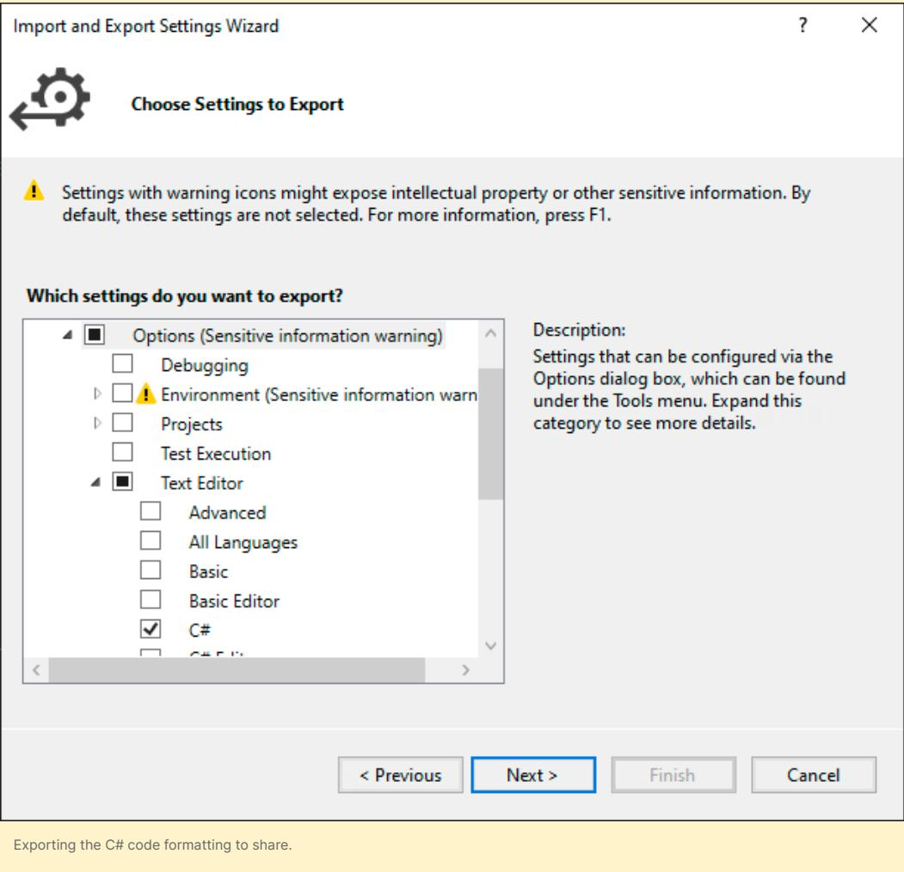
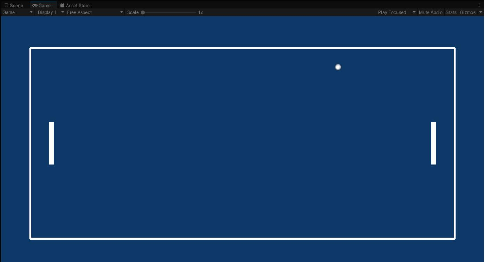
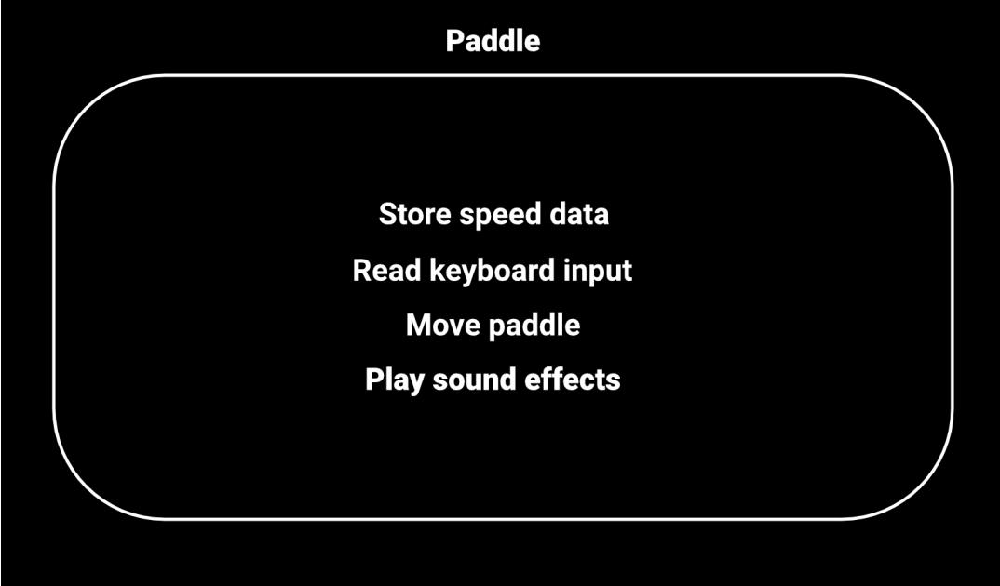
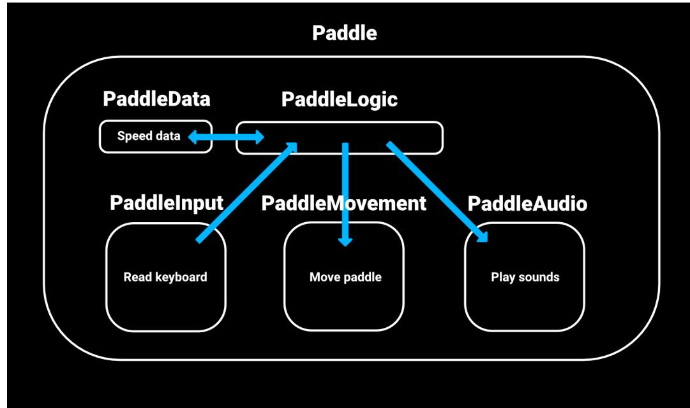
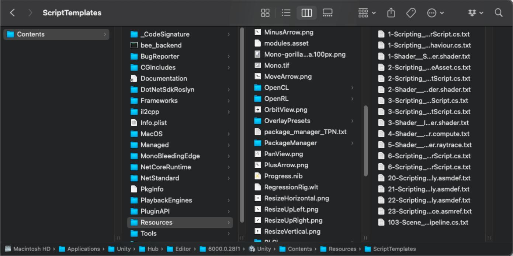
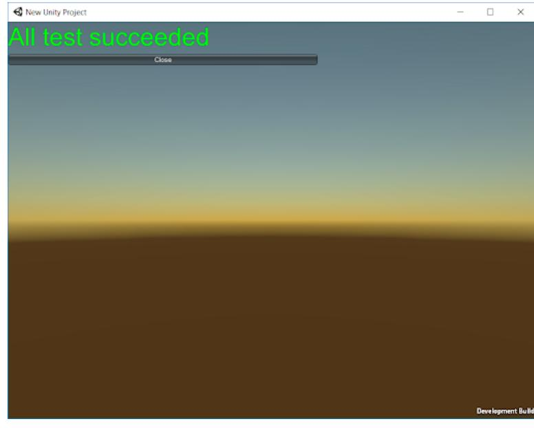

# **Use a C# style guide for clean and scalable game code**


### **Contents**

| Introduction 4                        |
|---------------------------------------|
| Contributors 5                        |
| Developing as a team 6                |
| KISS (keep it simple, stupid) 6       |
| The KISS principle 7                  |
| The YAGNI principle 7                 |
| Don't code around the problem 7       |
| Improve incrementally, every day 8    |
| Make it good, not perfect 8           |
| Plan, but adapt 8                     |
| Be consistent 8                       |
| It takes a village 8                  |
| Follow a style guide 9                |
|                                       |
| A style guide for you and your team 9 |
| Naming conventions 11                 |
| Identifier names 11                   |
| Casing terminology 12                 |
| Camel case (camelCase) 12             |
| Pascal case (PascalCase) 12           |
| Snake case (snake_case) 12            |
| Kebab case (kebab-case) 12            |
| Hungarian notation 13                 |
| Fields and variables 13               |
| Enums 17                              |
| Classes and interfaces 18             |

| Events and event handlers 19                |
|---------------------------------------------|
| Namespaces 21                               |
| Formatting 23                               |
| Properties 24                               |
| Serialization 26                            |
| Brace or indentation style 27               |
| What is EditorConfig? 31                    |
| Horizontal spacing 32                       |
| Vertical spacing 34                         |
| Regions 34                                  |
| Code formatting in Visual Studio 34         |
| Classes 38                                  |
| The newspaper metaphor 38                   |
| Class organization 39                       |
| Single-responsibility principle 40          |
| Refactoring example 42                      |
| Methods 43                                  |
| Methods vs functions? 44                    |
| Extension methods 44                        |
| The DRY principle: Don't repeat yourself 45 |
| Comments 48                                 |
| UI Toolkit naming conventions 51            |
| Common pitfalls 54                          |
| Conclusion 56                               |
| References 57                               |
| Appendix: Script templates 58               |
| Appendix: Testing and debugging 62          |
| Unity Test Framework 63                     |

# <span id="page-3-0"></span>Introduction

### *Clean code always looks like it was written by someone who cares.*

– Michael Feathers, author of *Working Effectively with Legacy Code*

Most game developers would agree that you need clean code: Code that is easy to read and efficient to maintain and reuse. Once your logic is functional, then the process of refactoring and cleaning up begins.

There are good reasons for this congruence. Something that might be obvious to you as the original author might be less apparent to another developer. By the same token, when you implement some logic now, you might not remember what that same code snippet does three months later.

Chances are you already have preferences for how to write your code today. However, your teammates of tomorrow will most likely have different preferences. While there is no right solution this guide provides some tips on how you can leverage a style guide to agree on standards.

<span id="page-4-0"></span>

This guide compiles advice from industry experts on how to use or adapt existing industry standard code style guides. Establishing such a guide for everyone in your team to follow will help ensure your codebase can grow your project to a commercial-scale production.

These tips and tricks will help your development process in the long term, even if they cost you extra effort up front. A cleaner, more scalable codebase also facilitates the efficient onboarding of new developers as you expand your team.

Keep your code clean to make life easier for yourself and everyone involved in the project.

Clean code aims to make development more scalable and conform to a set of production standards, including:

- Follow consistent naming conventions
- Format your code for legibility
- Organize classes and methods to keep them small and readable
- Comment on any code that isn't self-explanatory

Whether you're building a puzzler for mobile or a massive MMORPG targeted at consoles, keeping your codebase clean reduces the total cost of software maintenance. You can then implement new features or patch your existing software more easily.

Your future teammates – and your future self – will be thankful for that.

**Note**: This is the second edition of this e-book, now updated for Unity 6.

#### Contributors

This guide was written by Wilmer Lin, an independent game developer and educator. Significant contributions were also made by technical content marketing manager Thomas Krogh-Jacobsen and senior Unity engineers Peter Andreasen, Scott Bilas, and Mihai Popescu.

# <span id="page-5-0"></span>Developing as a team

*Any fool can write code that a computer can understand. Good programmers write code that humans can understand.*

– Martin Fowler, author of *Refactoring*

No developer is an island. As the technical needs of your game application grow, you'll need help. Inevitably, you'll add more team members with diverse skill sets. Clean code introduces coding standards for your ever-expanding team so everyone is on the same page. Now everybody can work on the same project with a more uniform set of guidelines.

Before looking into the specifics of code style guides, let's revisit some general, style-agnostic rules to help you scale up your Unity development.

### KISS (keep it simple, stupid)

Let's face it: Engineers and developers can overcomplicate things, even though computing and programming are hard enough. Use the [KISS principle](https://en.wikipedia.org/wiki/KISS_principle) of "keep it simple, stupid" as a guide for finding the simplest solution to the problem at hand.

<span id="page-6-0"></span>

There's no need to reinvent the wheel if a proven and simple technique solves your challenge. Unity already includes numerous solutions in its Scripting API. For example, if the existing [Hexagonal Tilemap](https://docs.unity3d.com/Manual/tilemaps/work-with-tilemaps/hexagonal-tilemaps.html) works for your strategy game, or the [UnityEngine.Pool](https://docs.unity3d.com/6000.0/Documentation/ScriptReference/Pool.ObjectPool_1.html) solves your object pooling system needs, skip writing your own. The best code you can write is no code at all.

## The KISS principle

The well-known [KISS principle](https://en.wikipedia.org/wiki/KISS_principle) emphasizes simplicity in design, an idea that's been popular throughout different times, as these quotes attest:

> "Simplicity is the ultimate sophistication." – Leonardo da Vinci

> > "Make simple tasks simple!" – Bjarne Stroustrup

"Simplicity is a prerequisite for reliability." – Edsger W. Dijkstra

"Everything should be made as simple as possible, but no simpler." – Albert Einstein

In programming, that means keeping your code as streamlined as possible. Avoid adding unnecessary complexity

#### The YAGNI principle

The related [YAGNI principle](https://en.wikipedia.org/wiki/You_aren%27t_gonna_need_it) ("you aren't gonna need it") instructs you to implement features only as you need them. Don't worry about features that you might need once the stars align. Build the simplest thing that you need now and build it to work.

#### Don't code around the problem

The first step of software development is to understand what you are trying to solve. This idea might seem like common sense, but too often developers get bogged down in implementing code without understanding the actual problem, or they'll modify the code until it works without fully grasping why.

What if, for example, you fixed a Null Reference Exception with a quick if-null statement at the top of a method? Are you sure that was the real culprit, or was the problem a call to another method deeper inside?

Instead of adding code to fix a problem, investigate the root cause. [Ask yourself why](https://en.wikipedia.org/wiki/Five_whys) it's happening rather than applying a band-aid solution.

<span id="page-7-0"></span>

#### Improve incrementally, every day

Making clean code is a fluid, iterative process. Get the whole team into this mindset, and expect code cleanup to be part of your day-to-day life as a developer. Most people don't intend to write broken code. It just evolves that way over time. Your codebase needs constant maintenance and upkeep, so budget time for that and make sure it happens.

#### Make it good, not perfect

On the flip side, don't strive for perfection. When your code meets production standards, it's time to commit it and move on.

Ultimately, your code needs to do something. Balance implementing new functionality with code cleanup. Don't refactor for the sake of it. Refactor when you think it will provide a benefit to you or somebody else.

#### Plan, but adapt

In *[The Pragmatic Programmer](https://en.wikipedia.org/wiki/The_Pragmatic_Programmer)*[, Andy Hunt and Dave Thomas](https://en.wikipedia.org/wiki/The_Pragmatic_Programmer) write, "Rather than construction, programming is more like gardening." Software engineering is an organic process, so be prepared and adapt for when things don't go according to plan.

Even if you make the most elaborate drawing, designing a garden on paper will not guarantee results. Your plants may bloom differently than you expected. You'll need to prune, transplant, and replace parts of your code to make this garden successful.

Software design isn't quite like an architect drawing blueprints because it's more malleable and less mechanical. You'll need to react as your codebase grows.

#### Be consistent

Once you decide how to tackle a problem, approach similar things the same way. It's not difficult but will take constant effort. Apply this principle to everything from naming (classes and methods, casing, etc.) to organizing project folders and resources.

Above all, have your team agree on a style guide and then follow it.

#### It takes a village

As Robert C. Martin, an American software engineer and author also known as "Uncle Bob" says, although keeping code clean and simple is in everyone's best interest, "clean and simple" is not the same as "easy." Clean and simple takes effort and is hard work for beginners and experienced developers alike.

Your project will become messy if left unchecked. It's a natural consequence of so many people working on different parts of a project. Everyone is responsible for pitching in and preventing code clutter, and each team member will need to read and follow the style guide.

# <span id="page-8-0"></span>Follow a style guide

### *There are only two hard things in Computer Science: cache invalidation and naming things.*

– Phil Karlton, software engineer

## A style guide for you and your team

This guide focuses on the most common coding conventions you'll encounter during Unity development. These are mostly a subset of the [Microsoft Framework Design Guidelines](https://docs.microsoft.com/en-us/dotnet/standard/design-guidelines/), which include an extensive number of rules beyond what is presented here.

These guidelines are recommendations, not hard and fast rules. Customize them according to your team's preferences. Pick a style that suits everyone and ensure they apply it.

Consistency is king. If you follow these suggestions and need to modify your style guide in the future, a few find-and-replace operations can migrate your codebase quickly.


When your style guide conflicts with this document or the Microsoft Framework Design Guidelines, it should take precedence over them because this will allow your team to maintain a uniform style throughout your project.

Your application is the collective product of individuals who might think differently from one another. A style guide helps rein in those differences to create a cohesive final product. No matter how many contributors work on a Unity project, it should feel like it's been developed by a single author.

Style guides take the guesswork out of coding conventions and formatting. Consistent style then becomes a matter of following directions.

If you're a solo developer, this might feel like a constraint at first, but following a style guide is essential when working in teams.

Think of a style guide as an initial investment that will pay dividends later. Maintaining a single set of standards can reduce the time spent on relearning if you move anyone onto another project.

Microsoft and Google both offer comprehensive example guides which are generally considered to be the industry standards:

- [Microsoft C# Coding Conventions](https://docs.microsoft.com/en-us/dotnet/csharp/fundamentals/coding-style/coding-conventions)
- [C# at Google Style Guide](https://google.github.io/styleguide/csharp-style.html)

These are excellent starting points for managing your Unity development and offer solutions for naming, formatting, and commenting.

At Unity, we don't enforce the same code style across all of our beginner tutorials, documentation and sample projects. The main reason for doing this is that a strict style guide can get in the way of the learning curve for beginner users vs a need to enforce more strict guidelines when working in large teams and more advanced use cases. There are simply different needs for someone just learning Unity and perhaps their first programming language, and engineering teams with 2000+ people.

In this guide, we thus follow a code style that extends [Microsoft's Framework Design](https://docs.microsoft.com/en-us/dotnet/standard/design-guidelines/)  [Guidelines,](https://docs.microsoft.com/en-us/dotnet/standard/design-guidelines/) which defines a number of rules not covered by this document. This code style is closer to that which is used by our engineering and documentation teams, and what we believe will be well-suited for most Unity projects – a style that balances pragmatism over strictness.

Ultimately, the key is to choose one that works for you and your team and maintain consistency throughout your project.

We created an example [C# style sheet](https://github.com/thomasjacobsen-unity/Unity-Code-Style-Guide) that you can also use as a reference as you assemble your own guide. Feel free to copy and tweak it as needed.

Let's dive in.

# <span id="page-10-0"></span>Naming conventions

There's a deep psychology involved in giving something a name. A name tells us how that entity fits into the world. What is it? Who is it? What can it do for us?

The names of your variables, classes, and methods aren't mere labels. They carry weight and meaning. Good naming style impacts how someone reading your program can comprehend the idea you're trying to convey.

Here are some guidelines to consider for naming.

#### Identifier names

An [identifier](https://docs.microsoft.com/en-us/dotnet/csharp/language-reference/language-specification/lexical-structure#identifiers) is any name you assign to a type (class, interface, struct, delegate, or enum), member, variable, or namespace.

Avoid special characters (backslashes, symbols, Unicode characters) in your identifiers, even though C# permits them. These can interfere with certain Unity command-line tools. Steer clear of unusual characters to ensure compatibility with most platforms.

<span id="page-11-0"></span>

## Casing terminology

You can't define variables with spaces in the name because C# uses the space character to separate identifiers. Casing schemes can alleviate the problem of using compound names or phrases in source code. There are several well-known naming and casing conventions.

#### **Camel case (camelCase)**

Also known as camel caps, [camel case](https://en.wikipedia.org/wiki/Camel_case) is the practice of writing phrases without spaces or punctuation, separating words with a single capitalized letter. The very first letter is lowercase. Local variables and method parameters are camel case. For example:

```
examplePlayerController
maxHealthPoints
endOfFile
```
#### **Pascal case (PascalCase)**

Pascal case is a variation of camel case, where the initial letter is capitalized. Use this for class, public fields and method names in Unity development. For example:

```
ExamplePlayerController
MaxHealthPoints
EndOfFile
```
#### **Snake case (snake\_case)**

In this case, spaces between words are replaced with an underscore character. For example:

```
example_player_controller
max_health_points
end_of_file
```
#### **Kebab case (kebab-case)**

Here, spaces between words are replaced with dashes. The words appear on a "skewer" of dash characters. For example:

```
example-player-controller
Max-health-points
end-of-file 
naming-conventions-methodology
```
The Kebab-case is widely used in web technologies and namely for CSS. We are also recommending it for use with UI Toolkit USS as we will be covering later in the guide.

<span id="page-12-0"></span>

#### **Hungarian notation**

The variable or function name often indicates its intention or type. For example:

int iCounter string strPlayerName Hungarian notation is an older convention and is not common in Unity development.

#### Fields and variables

Consider these rules for your variables and [fields:](https://docs.microsoft.com/en-us/dotnet/csharp/programming-guide/classes-and-structs/fields)

- **Use nouns for variable names:** Variable names should be descriptive, clear, and unambiguous because they represent a thing or state. So use a noun when naming them except when the variable is of the type bool (see below).
- **Prefix Booleans with a verb:** These variables indicate a true or false value. Often they are the answer to a question, such as – is the player running? Is the game over? Prefix them with a verb to make their meaning more apparent. Often this is paired with a description or condition, e.g. isDead, isWalking, hasDamageMultiplier, etc.
- **Use meaningful names. Don't abbreviate (unless it's math):** Your variable names should reveal their intent. Choose names that are easy to pronounce and search for – not just for your colleagues but also to provide extra context to the code for when using AI tools, as this can contribute to more accurate code generation and suggestions. Choose identifier names that are easily readable. For example, a property named HorizontalAlignment is more readable than AlignmentHorizontal.

Single letter variables are fine for loops and math expressions, but otherwise, don't abbreviate. Clarity is more important than any time saved from omitting a few vowels.

You might be tempted to use short "junk" names when prototyping, but this won't save you time if you need to refactor the code at a later date. Pick meaningful names from the beginning.

| Examples to avoid                         | Use instead                                                | Notes                                                                                                              |
|-------------------------------------------|------------------------------------------------------------|--------------------------------------------------------------------------------------------------------------------|
| int d                                     | int elapsedTimeInDays                                      | Avoid single letter<br>abbreviations unless a counter<br>or expression. Be specific<br>about the measurement unit. |
| int hp,<br>string tName,<br>int mvmtSpeed | int healthPoints,<br>string teamName,<br>int movementSpeed | Variable names reveal intent.<br>Make names searchable and<br>pronounceable.                                       |
| int getMovement<br>Speed                  | int movementSpeed                                          | Use nouns. Reserve verbs<br>for methods unless it's a bool<br>(below).                                             |
| bool dead                                 | bool isDead,<br>bool isPlayerDead                          | Booleans ask a question that<br>can be answered true or false.                                                     |

- **Use pascal case (MyPropertyName) for public fields. Use camel case (myPrivateVariable) for private variables:** For an alternative to public fields, use Properties with a public getter (see Formatting below).
- **Consider using prefixes or special encoding:** Some guides suggest adding a prefix to private member variables with an underscore (\_) to differentiate them from local variables. In our style guides we use prefixes for private member variables (m\_), constants (k\_), or static variables (s\_), so the name can reveal more about the variable at a glance. For example, movementSpeed becomes m\_movementSpeed.

Mixing PascalCase with the prefix such as m\_MovementSpeed is also an option but is generally less commonly used in modern C#.

Alternatively, use the this keyword to distinguish between member and local variables in context and skip the prefix. Public fields and properties generally don't have prefixes. Local variables and parameters use camel case with no prefix.

Many developers eschew these and rely on the editor instead. IDEs today support highlighting, color coding, and rich context.

— **Fields are automatically initialized to their default values:** Default value is typically 0 for numeric types like int, while reference type fields (e.g., objects) are initialized to null by default, and bool fields are initialized to false by default. Given this, explicitly setting a field to its default value is generally unnecessary.


— **Name constant variables with k\_ as prefix and in PascalCase:** This helps to distinguish constants from regular variables or properties, and makes the code easier to read and maintain.

```
// EXAMPLE: constants
public class MathConstants
{
 public const int k_MaxItems = 100;
}
```
— **Specify (or omit) access level modifiers consistently:** If you leave off the access modifier, the compiler will assume the access level to be private. This works well, but be consistent in how you omit the default access modifier.

MSFT guidelines recommended to explicitly specify private to make the access level clear and to avoid any ambiguity. Other guides argue you should drop redundant access specifiers (leave off 'private' at type scope) and, similarly, drop redundant initializers (i.e. no '= 0' on the ints, '= null' on ref types, etc.). Remember that you'll need to use protected if you want this in a subclass later. We recommend to leave out things that are implicit and thus redundant (such as private) for simplicity if you agree that it doesn't negatively affect readability for you.

— **Favor readability over brevity:** As [this example](https://learn.microsoft.com/en-us/dotnet/standard/design-guidelines/general-naming-conventions) from the MSFT documentation shows, the property name CanScrollHorizontally is better than ScrollableX (an obscure reference to the X-axis).

#### **Example code snippets**

The code snippets in this guide are non-functional and abbreviated. They're presented here to show style and formatting.

You can also reference this [example C# style sheet for Unity developers,](https://github.com/thomasjacobsen-unity/Unity-Code-Style-Guide/blob/master/StyleExample.cs) which is a modified version of [Microsoft's Framework Design Guidelines.](https://docs.microsoft.com/en-us/dotnet/standard/design-guidelines/) This represents just one example of how you can set up your team's style guide.

Review each rule in the example style guide and customize it to your team's preferences. The specifics of an individual rule are less important than having everyone agree to follow it consistently. When in doubt, rely on your team's own guide to settle any style disagreements.

```
// EXAMPLE: public and private variables are grouped together. 
public float DamageMultiplier = 1.5f;
public float MaxHealth;
public bool IsInvincible;
private bool m_isDead;
```


```
private float m_currentHealth;
public void InflictDamage(float damage, bool isSpecialDamage)
{
 // local variable
 int totalDamage = damage;
 // local variable versus public member variable
 if (isSpecialDamage)
 {
 totalDamage *= DamageMultiplier;
 }
 // local variable versus private member variable
 if (totalDamage > _currentHealth)
 {
 /// ...
 }
}
```
- **Use one variable declaration per line:** It's less compact, but enhances readability.
- **Avoid redundant names:** If your class is called Player, you don't need to create member variables called PlayerScore or PlayerTarget. Trim them down to Score or Target.
- Drop redundant initializers (i.e. no '= 0' on the ints, '= null' on ref types, etc.).
- **Avoid jokes or puns:** While they might elicit a chuckle now, the infiniteMonkeys or dudeWheresMyChar variables won't hold up after a few dozen reads, and more importantly, it violates our previous stated goal of naming revealing context.
- **While avoiding ambiguity and always looking for ways to improve readability, you can use var when the type is clear from the context:** With good naming ambiguity should be less of an issue because variable names already convey the intent. Refactoring is simpler with var since it abstracts away the specific type, reducing the number of places where code needs to be updated when types change. In foreach loops, var ensures that the iteration variable matches the type provided by the enumerator. If you explicitly declare a mismatched type, the compiler may allow it, leading to runtime errors.

```
// EXAMPLE: good use of var
var powerUps = new List<PowerUps>();
var dictionary = new Dictionary<string, List<GameObject>>();
// AVOID: potential ambiguity
var powerUps = PowerUpManager.GetPowerUps();
```
<span id="page-16-0"></span>

#### Enums

Enums are special value types defined by a set of named constants. By default, the constants are integers, counting up from 0.

Use Pascal case for enum names and values. You can place public enums outside of a class to make them global. Use a singular noun for the enum name as it represents a single value from a set of possible values. They should have no prefix or suffix.

Note: bitwise enums marked with the [System.FlagsAttribute](https://docs.microsoft.com/en-us/dotnet/api/system.flagsattribute?view=net-5.0) attribute are the exception to this rule. You typically pluralize these as they represent more than one type.

```
// EXAMPLE: enums use singular nouns
public enum WeaponType
{
 Knife,
 Gun,
 RocketLauncher, 
 BFG
}
public enum FireMode
{
 None = 0,
 Single = 5,
 Burst = 7,
 Auto = 8, 
}
// EXAMPLE: but a bitwise enum is plural (you can also use the 1 << bitnum style)
[Flags] 
public enum AttackModes 
{
 // Decimal // Binary
 None = 0, // 000000
 Melee = 1, // 000001
 Ranged = 2, // 000010
 Special = 4, // 000100
 MeleeAndSpecial = Melee | Special // 000101
}
```
<span id="page-17-0"></span>

#### Classes and interfaces

Follow these standard rules when naming your classes and interfaces:

- **Use Pascal case nouns or noun phrases for class names:** This distinguishes type names from methods, which are named with verb phrases.
- **If you have a Monobehaviour in a file, the source file name must match:** You may have other internal classes in the file, but only one Monobehaviour should exist per file.
- **Prefix interface names with a capital I:** Follow this with an adjective that describes the functionality.

```
// EXAMPLE: Class formatting
public class ExampleClass : MonoBehaviour
{
 public int PublicField;
 public static int MyStaticField;
 private int m_packagePrivate;
 private int m_myPrivate;
 private static int m_myPrivate;
 protected int m_myProtected;
 public void DoSomething()
 {
 }
}
// EXAMPLE: Interfaces
public interface IKillable
{
 void Kill();
}
public interface IDamageable<T>
{
 void Damage(T damageTaken);
}
```
<span id="page-18-0"></span>

### Methods

In C#, every executed instruction is performed in the context of a method.

**Note:** "function" and "method" are often used interchangeably in Unity development. However, because you can't write a function without incorporating it into a class in C#, "method" is the accepted term.

Methods perform actions, so apply these rules to name them accordingly:

- **Start the name with a verb or verb phrases:** Add context if necessary. e.g. GetDirection, FindTarget, etc.
- **Use camel case for parameters:** Format parameters passed into the method like local variables.
- **Methods returning bool should ask questions:** Much like Boolean variables themselves, prefix methods with a verb if they return a true-false condition This phrases them in the form of a question, e.g. IsGameOver, HasStartedTurn.

```
// EXAMPLE: Methods start with a verb
public void SetInitialPosition(float x, float y, float z)
{
 transform.position = new Vector3(x, y, z);
}
// EXAMPLE: Methods ask a question when they return bool
public bool IsNewPosition(Vector3 currentPosition)
{
 return (transform.position == newPosition);
}
```
#### Events and event handlers

Events in C# implement the [observer pattern](https://en.wikipedia.org/wiki/Observer_pattern). This software design pattern defines a relationship in which one object, the subject (or publisher), can notify a list of dependent objects called observers (or subscribers). Thus, the subject can broadcast state changes to its observers without tightly coupling the objects involved. You can learn more about using the observer and other design patterns in your Unity projects in the e-book *[Level up your code](https://unity.com/resources/design-patterns-solid-ebook?isGated=false)  [with design patterns and SOLID](https://unity.com/resources/design-patterns-solid-ebook?isGated=false)*.

Several naming schemes exist for events and their related methods in the subject and observers. Try these practices:

— **Name the event with a verb phrase:** Choose a name that communicates the state change accurately. Use the present or past participle to indicate events "before" or "after." For example, specify "OpeningDoor" for an event before opening a door or "DoorOpened" for an event afterward.


— **Use the System.Action delegate for events:** In most cases, the [Action<T>](https://docs.microsoft.com/en-us/dotnet/api/system.action-1?view=net-5.0) delegate can handle the events needed for gameplay. You may pass anywhere from 0 to 16 input parameters of different types with a return type of void. Using the predefined delegate saves code.

Note: You can also use the [EventHandler](https://docs.microsoft.com/en-us/dotnet/api/system.eventhandler?view=net-5.0) or [EventHandler<TEventArgs>](https://docs.microsoft.com/en-us/dotnet/api/system.eventhandler-1?view=net-5.0) delegates. Agree as a team on how everyone will implement events.

```
// EXAMPLE: Events 
// using System.Action delegate
public event Action OpeningDoor; // event before
public event Action DoorOpened; // event after
public event Action<int> PointsScored;
public event Action<CustomEventArgs> ThingHappened;
```
— **Prefix the event raising method (in the subject) with "On":** The subject that invokes the event typically does so from a method prefixed with "On," e.g. "OnOpeningDoor" or "OnDoorOpened."

```
// raises the Event if you have subscribers
public void OnDoorOpened()
{
 DoorOpened?.Invoke();
}
public void OnPointsScored(int points)
{
 PointsScored?.Invoke(points);
}
```
— **Consider prefixing the event handling method (in the observer) with the subject's name and underscore (\_):** If the subject is named "GameEvents," your observers can have a method called "GameEvents\_OpeningDoor" or "GameEvents\_DoorOpened."

Note that this is called the "event handling method", not to be confused with the EventHandler delegate.

<span id="page-20-0"></span>

— **Create custom EventArgs only as necessary:** If you need to pass custom data to your Event, create a new type of EventArgs, either inherited from [System.EventArgs](https://docs.microsoft.com/en-us/dotnet/api/system.eventargs?view=net-5.0) or from a custom struct.

```
// define an EventArgs if needed
// EXAMPLE: read-only, custom struct used to pass an ID and Color
public struct CustomEventArgs
{
 public int ObjectID { get; }
 public Color Color { get; }
 public CustomEventArgs(int objectId, Color color)
 {
 this.ObjectID = objectId;
 this.Color = color;
 }
}
```
#### Namespaces

Use [namespaces](https://docs.microsoft.com/en-us/dotnet/csharp/fundamentals/types/namespaces) to ensure that your classes, interfaces, enums, etc. won't conflict with existing ones from other namespaces or the global namespace. Namespaces can also prevent conflicts with third-party assets from the Asset Store.

When applying namespaces:

- Use PascalCase without special symbols or underscores.
- Add a using directive at the top of the file to avoid repeated typing of the namespace prefix.
- Create sub-namespaces as well. Use the dot(.) operator to delimit the name levels, allowing you to organize your scripts into hierarchical categories. For example, you can create MyApplication.GameFlow, MyApplication.AI, MyApplication.UI, and so on to hold different logical components of your game.
- Some prefer to have namespaces that reflect the folder structure of the project as having logically grouped related classes and components together, also makes it easier to find and understand the structure of the codebase.


```
namespace Enemy 
{
 public class Controller1 : MonoBehaviour 
 {
 ...
 }

 public class Controller2 : MonoBehaviour 
 {
 ...
 }
}
```
In code, these classes are referred to as Enemy.Controller1 and Enemy.Controller2, respectively. Add a using line to save typing out the prefix:

using Enemy;

When the compiler finds the class names Controller1 and Controller2, it understands you mean Enemy.Controller1 and Enemy.Controller2.

If the script needs to refer to classes with the same name from different namespaces, use the prefix to differentiate them. For instance, if you have a Controller1 and Controller2 class in the Player namespace, you can write out Player.Controller1 and PlayerController2 to avoid any conflicts. Otherwise, the compiler will report an error.

# <span id="page-22-0"></span>Formatting

### *If you want your code to be easy to write, make it easy to read.*

– Robert C. Martin, author of *Clean Code and Agile Software Development*

The less you think about formatting, the more you can work on something else.

Along with naming, formatting helps reduce guesswork and improves code clarity. By following a standardized style guide, code reviews become less about how the code looks and more about what it does.

Omit, expand, or modify these example rules to fit your team's needs.

In all cases, consider how your team will implement each formatting rule and then have everyone apply it uniformly. Refer back to your team's style to resolve any discrepancies.

Consider each of the following code formatting suggestions when setting up your Unity dev style guide.

<span id="page-23-0"></span>

### Properties

A property provides a flexible mechanism to read, write, or compute class values. Properties behave as if they were public member variables, but in fact they're special methods called [accessors.](https://docs.microsoft.com/en-us/dotnet/csharp/programming-guide/classes-and-structs/using-properties) Each property has a get and set method to access a private field, called a [backing](https://docs.microsoft.com/en-us/ef/core/modeling/backing-field?tabs=data-annotations)  [field](https://docs.microsoft.com/en-us/ef/core/modeling/backing-field?tabs=data-annotations).

In this way, the property [encapsulates](https://en.wikipedia.org/wiki/Encapsulation_(computer_programming)#Information_hiding) the data, hiding it from unwanted changes by the user or external objects. The getter and setter each have their own access modifier, allowing your property to be read-write, read-only, or write-only.

You can also use the accessors to validate or convert the data (e.g., verify that the data fits your preferred format or change a value to a particular unit).

The syntax for properties can vary, so your style guide should define how to format them. Use these tips to keep properties consistent in your code:

— **Use expression-bodied properties for single line read-only properties** (=>): This returns the private backing field.

```
// EXAMPLE: expression bodied properties
public class PlayerHealth
{
 // the private backing field
 private int m_maxHealth;
 // read-only, returns backing field
 public int MaxHealth => m_maxHealth;
 // equivalent to:
 // public int MaxHealth { get; private set; }
}
```
— **Everything else uses the older** { get; set; } **syntax:** If you just want to expose a public property without specifying a backing field, use the [Auto-Implemented property](https://docs.microsoft.com/en-us/dotnet/csharp/programming-guide/classes-and-structs/auto-implemented-properties).

Apply the expression-bodied syntax for the set and get accessors.

Remember to make the setter private if you don't want to give write access. Align the closing with the opening brace for multi-line code blocks.

```
// EXAMPLE: expression bodied properties
public class PlayerHealth
{
 // backing field
 private int m_maxHealth;
 // explicitly implementing getter and setter
 public int MaxHealth
 {
 get => m_maxHealth;
 set => m_maxHealth = value;
 }
 // write-only (not using backing field)
 public int Health { private get; set; }
 // write-only, without an explicit setter
 public SetMaxHealth(int newMaxValue) => _maxHealth = newMaxValue;
}
```
— While you can also use functions to expose private data as in our example below, it's generally recommended to use properties for simple get/set operations. For operations involving complex logic or computation, methods are generally recommended.

```
// EXAMPLE: expression bodied properties
public class PlayerHealth
{
 // backing field
 private int m_maxHealth;
 public int GetMaxHealth
 {
 return m_maxHealth;
 }
}
```
### <span id="page-25-0"></span>Serialization

Script serialization is the automatic process of transforming data structures or object states into a format that Unity can store and reconstruct later. For performance reasons, Unity handles serialization differently than in other programming environments.

Serialized fields appear in the Inspector, but you cannot serialize static, constant, or readonly fields. They must be either public or tagged with the [SerializeField] attribute. Unity only serializes certain field types, so refer to the [documentation page](https://docs.unity3d.com/Manual/script-serialization.html) for the complete set of serialization rules.

Observe a few basic guidelines when working with serialized fields:

- **Use the** [SerializeField] **attribute:** The SerializeField attribute can work with private or protected variables to make them appear in the Inspector. This encapsulates the data better than marking the variable public and prevents an external object from overwriting its values.
- **Use the Range attribute to set minimum and maximum values:** The [Range(min, max)] attribute is handy if you want to limit what the user can assign to a numeric field. It also conveniently represents the field as a slider in the Inspector.
- **Group data in serializable classes or structs to clean up the Inspector:** Define a public class or struct and mark it with the [Serializable] attribute. Define public variables for each type you want to expose in the Inspector.

```
// EXAMPLE: a serializable class for PlayerStats
using System;
using UnityEngine;
public class Player : MonoBehaviour
{
 [Serializable]
 public struct PlayerStats
 {
 public int MovementSpeed;
 public int HitPoints;
 public bool HasHealthPotion;
 }
// EXAMPLE: The private field is visible in the Inspector
 [SerializeField]
 private PlayerStats m_stats;
}
```
Reference this serializable class from another class. The resulting variables appear within collapsible units in the Inspector.

<span id="page-26-0"></span>

| namespace MyApplication                                                                 |                     |                 |                    |          |     |
|-----------------------------------------------------------------------------------------|---------------------|-----------------|--------------------|----------|-----|
| public class Player : MonoBehaviour<br>1<br>[Serializable]<br>public struct PlayerStats |                     |                 |                    |          |     |
| public int MovementSpeed;                                                               | O Inspector         |                 |                    |          | ക : |
| public int HitPoints;<br>public bool HasHealthPotion;                                   | D<br>Player         |                 |                    | Static ▼ |     |
|                                                                                         | Tag Untagged        |                 | Layer Default<br>> |          |     |
|                                                                                         | 2<br>Transform<br>> |                 |                    | @ 花      |     |
| [SerializeField]                                                                        | Position            | × 0             | Y O                | Z O      |     |
| private PlayerStats stats;                                                              | Rotation            | × 0             | Y O                | Z O      |     |
| }                                                                                       | Scale               | × 1             | Y 1                | Z 1      |     |
|                                                                                         | #<br>V              | Player (Script) |                    | 0 花      |     |
|                                                                                         | Script              | Player          |                    |          | 0   |
|                                                                                         | ▼ Stats             |                 |                    |          |     |
|                                                                                         | Movement Speed      | 15              |                    |          |     |
|                                                                                         | Hit Points          | 100             |                    |          |     |
|                                                                                         | Has Health Potion   | >               |                    |          |     |

A serializable class or struct can help organize the Inspector.

### Brace or indentation style

There are two common indentation styles in C#:

- The [Allman style](https://en.wikipedia.org/wiki/Indentation_style#Allman_style) places the opening curly braces on a new line, also known as the BSD style (from BSD Unix).
- The [K&R style](https://en.wikipedia.org/wiki/Indentation_style#K&R_style), or "one true brace style," keeps the opening brace on the same line as the previous header.

```
// EXAMPLE: Allman or BSD style puts opening brace on a new line.
void DisplayMouseCursor(bool showMouse) 
{
 if (!showMouse)
 {
 Cursor.lockState = CursorLockMode.Locked;
 Cursor.visible = false;
 }
 else
 {
```

```
 Cursor.lockState = CursorLockMode.None;
 Cursor.visible = true;
 }
}
// EXAMPLE: K&R style puts opening brace on the previous line.
void DisplayMouseCursor(bool showMouse){
 if (!showMouse) {
 Cursor.lockState = CursorLockMode.Locked;
 Cursor.visible = false;
 }
 else {
 Cursor.lockState = CursorLockMode.None;
 Cursor.visible = true;
 }
}
```
There are variations on these [indentation styles](https://en.wikipedia.org/wiki/Indentation_style) as well. The examples in this guide use the Allman style from the [Microsoft Framework Design Guidelines.](https://docs.microsoft.com/en-us/dotnet/standard/design-guidelines/) Regardless of which one you choose as a team, make sure everyone follows the same indentation and brace style.

Try these tips:

— **Decide on a uniform indentation:** This is typically four or two spaces. Get everyone on your team to agree on a setting in your Editor preferences without igniting a [tabs versus](https://thenewstack.io/spaces-vs-tabs-a-20-year-debate-and-now-this-what-the-hell-is-wrong-with-go/)  [spaces flame war](https://thenewstack.io/spaces-vs-tabs-a-20-year-debate-and-now-this-what-the-hell-is-wrong-with-go/). Note that Visual Studio provides the option to convert tabs to spaces.

| Search Options (Ctrl+E)                                                                                                                                            | P | Indenting                                                                                                                                                                                                                                           |  |
|--------------------------------------------------------------------------------------------------------------------------------------------------------------------|---|-----------------------------------------------------------------------------------------------------------------------------------------------------------------------------------------------------------------------------------------------------|--|
| General<br>Advanced<br>File Extension<br>> All Languages<br>▷ Basic<br>A C#<br>General<br>Scroll Bars<br>Tabs<br>Advanced<br>Code Style<br>IntelliSense<br>▷ C/C++ | > | O None<br>O Block<br>● Smart<br>Tab<br>বাঁ<br>Tab size:<br>Indent size:<br>বা<br>● Insert spaces<br>O Keep tabs<br>Adaptive formatting may override your custom tab settings. You can turn off<br>adaptive formatting under Text Editor > Advanced. |  |
| ▷ Plain Text<br>D XML<br>Debugging<br>△                                                                                                                            |   |                                                                                                                                                                                                                                                     |  |
| NuGet Package Manager<br>△                                                                                                                                         |   |                                                                                                                                                                                                                                                     |  |
| Test<br>△                                                                                                                                                          |   |                                                                                                                                                                                                                                                     |  |
| Text Templating<br>>                                                                                                                                               |   |                                                                                                                                                                                                                                                     |  |
| Tools for Unity<br>△                                                                                                                                               |   |                                                                                                                                                                                                                                                     |  |
| > Web Performance Test Tools                                                                                                                                       | V |                                                                                                                                                                                                                                                     |  |

|  |  |  |  | In Visual Studio (Windows), navigate to Tools > Options > Text Editor > C# > Tabs. |  |  |  |  |  |
|--|--|--|--|------------------------------------------------------------------------------------|--|--|--|--|--|
|--|--|--|--|------------------------------------------------------------------------------------|--|--|--|--|--|

Tabs settings in Visual Studio

On Visual Studio for Mac, navigate to **Preferences > Source Code > C# Source Code**. Select the Text Style to adjust the settings.

| 00                       | Preferences                              |
|--------------------------|------------------------------------------|
| Android                  | C# source code                           |
| ios                      |                                          |
| ▼ Publishing             | Policy: Default                          |
| Apple Developer Accounts |                                          |
| ▼ Text Editor            | Text Style C# Format                     |
| Ø General                | Use default settings from 'Text file'    |
| 國 Markers and Rulers     |                                          |
| ► @ Behavior             | --<br>Desired file width:  80<br>columns |
| 目 IntelliSense           | Line endings:   Native                   |
| J Color Theme            |                                          |
| … Code Snippets          | Whitespace                               |
| ് Language Bundles       | 1 D<br>Tab width:<br>पै                  |
| > @ Source Analysis      | Indent width:   4                        |
| ি XML Schemas            |                                          |
| T Source Code            | Convert tabs to spaces<br>>              |
| .NET Naming Policies     | Allow tabs after non-tabs<br>V           |
| ▼ Code Formatting        |                                          |
| િ XML document           | Remove trailing whitespace<br>>          |
| 鲁 Text file              |                                          |
| {} C# source code        |                                          |
| oss CSS                  |                                          |
| C HTML                   |                                          |
| O JSON                   |                                          |
| ಟ್ಟಾ] LESS, CSS document |                                          |
| ്ച്ചി SCSS, CSS document |                                          |
| ි F # files              |                                          |
| #] Standard Header       |                                          |
|                          |                                          |

Convert tabs to spaces to make indentation uniform.


— **Where possible, don't omit braces, even for single-line statements:** This increases consistency, keeping your code easier to read and maintain. In this example, the braces clearly separate the action, DoSomething, from the loop.

If later you need to add a Debug line or to run DoSomethingElse, the braces will already be in place. Some programmers argue that keeping the clause on a separate line allows you to add a breakpoint easily.

```
// EXAMPLE: keep braces for clarity...
for (int i = 0; i < 100; i++) { DoSomething(i); }
// … and/or keep the clause on a separate line.
for (int i = 0; i < 100; i++)
{
 DoSomething(i);
}
// AVOID: omitting braces
for (int i = 0; i < 100; i++) DoSomething(i);
```
— **Don't remove braces from nested multi-line statements:** Removing braces in this case won't throw an error, but can be confusing. Apply braces for clarity, even if they are optional. Braces also ensure that modifications, such as adding new logic, can be done safely without needing to refactor the surrounding structure.

```
// EXAMPLE: keep braces for clarity
for (int i = 0; i < 10; i++)
{
      for (int j = 0; j < 10; j++)
 {
 ExampleAction();
 }
}
// AVOID: removing braces from nested multi-line statements
for (int i = 0; i < 10; i++)
      for (int j = 0; j < 10; j++)
 ExampleAction();
```
<span id="page-30-0"></span>

— **Standardize your switch statements:** It's generally advisable to replace longer if-else chains with a switch statement for better readability. Here is one example where you indent the case statements. It's generally recommended to include a default case as well. Even if the default case is not needed (for example, in cases where all possibilities are covered), including one ensures that the code is prepared to handle unexpected values.

```
// EXAMPLE: indent cases from the switch statement
switch (someExpression) 
{
 case 0:
 DoSomething();
 break;
 case 1:
 DoSomethingElse();
 break;
 case 2: 
 int n = 1;
 DoAnotherThing(n);
 break;
 default:
 // Handle unexpected or default case
 break;
}
```
## What is EditorConfig?

Do you have multiple developers working on the same project with different editors and IDEs? Consider using an **[EditorConfig](https://docs.microsoft.com/en-us/visualstudio/ide/create-portable-custom-editor-options?view=vs-2019)** file.

The EditorConfig file can help you define a coding style that works across your entire team. Many IDEs, like Visual Studio and Rider, come bundled with native support and do not require a separate plugin.

[EditorConfig](https://editorconfig.org) files are easily readable and work with version control systems. You can see an [example file here](https://editorconfig.org/#example-file). The code styling from EditorConfig travels with your code and can enforce coding styles even outside of Visual Studio.

EditorConfig settings take precedence over the global Visual Studio text editor settings. Your personal editor preferences still apply whenever you're working in a codebase without a **.editorconfig** file, or when the **.editorconfig** file doesn't override a particular setting.

See the GitHub repo for some [real-world samples](https://github.com/editorconfig/editorconfig/wiki/Projects-Using-EditorConfig).

### <span id="page-31-0"></span>Horizontal spacing

Something as simple as spacing can enhance your code's appearance on-screen. Your personal formatting preferences can vary, but try the following suggestions to improve readability:

— **Add spaces to decrease code density:** The extra whitespace can give a sense of visual separation between parts of a line improving readability.

```
// EXAMPLE: add spaces to make lines easier to read
for (int i = 0; i < 100; i++) { DoSomething(i); }
// AVOID: no spaces
for(inti=0;i<100;i++){DoSomething(i);}
```
— **Use a single space after a comma between function arguments.**

```
// EXAMPLE: single space after comma between arguments
CollectItem(myObject, 0, 1);
// AVOID: leaving out spacing
```

```
CollectItem(myObject,0,1);
```
— **Don't add a space after the parenthesis and function arguments.**

```
// EXAMPLE: no space after the parenthesis and function arguments
DropPowerUp(myPrefab, 0, 1);
```
//AVOID: DropPowerUp( myPrefab, 0, 1 );

— **Don't use spaces between a function name and parenthesis**.

```
// EXAMPLE: omit spaces between a function name and parenthesis.
DoSomething()
// AVOID
```
DoSomething ()

— **Avoid spaces inside brackets.**

```
// EXAMPLE: omit spaces inside brackets
x = dataArray[index];
// AVOID
x = dataArray[ index ];
```


— **Use a single space before flow control conditions:** Add a space between the flow comparison operator and the parentheses.

// EXAMPLE: space before condition; separate parentheses with a space. while (x == y) // AVOID while(x==y)

— **Use a single space before and after comparison operators.**

```
// EXAMPLE: space before condition; separate parentheses with a space.
if (x == y)
```
// AVOID

if (x==y)

- **Keep lines short. Consider horizontal whitespace:** Decide on a standard line width (80- 120 characters). Break a long line into smaller statements rather than letting it overflow.
- **Maintain indentation/hierarchy:** Indent your code to increase legibility.
- **Don't use column alignment unless needed for readability:** This type of spacing aligns the variables but can make it difficult to pair the type with the name.

Column alignment, however, can be useful for bitwise expressions or structs with a lot of data. Just be aware that it may create more work for you to maintain the column alignment as you add more items. Some auto-formatters might also change which part of the column gets aligned.

```
// EXAMPLE: One space between type and name
 public float Speed = 12f;
 public float Gravity = -10f;
 public float JumpHeight = 2f;
 public Transform GroundCheck;
 public float GroundDistance = 0.4f;
 public LayerMask GroundMask;
// AVOID: column alignment
 public float Speed = 12f;
 public float Gravity = -10f;
 public float JumpHeight = 2f;
 public Transform GroundCheck;
 public float GroundDistance = 0.4f;
 public LayerMask GroundMask;
```
### <span id="page-33-0"></span>Vertical spacing

You can use the vertical spacing to your advantage as well. Keep related parts of the script together and use blank lines to your advantage. Try these suggestions to organize your code from top to bottom:

- **Group dependent and/or similar methods together:** Code needs to be logical and coherent. Keep methods that do the same thing next to one another, so someone reading your logic doesn't have to jump around the file.
- **Use the vertical whitespace to your advantage to separate distinct parts of your class**: For example, you can add two blank lines between:
	- Variable declarations and methods
	- Classes and Interfaces
	- if-then-else blocks (if it helps readability)

Keep this to a minimum and note on your style guide where applicable.

#### Regions

The #region directive enables you to collapse and hide sections of code in C# files, making large files more manageable and easier to read.

However, if you follow the general advice for Classes from this guide, your class size should be manageable and the #region directive superfluous. Break your code into smaller classes instead of hiding code blocks behind regions. You will be less inclined to add a region if the source file is short.

**Note:** Many developers consider [regions to be code smells or anti-patterns.](https://softwareengineering.stackexchange.com/questions/53086/are-regions-an-antipattern-or-code-smell) Decide as a team on which side of the debate you fall.

## Code formatting in Visual Studio

Don't despair if these formatting rules seem overwhelming. Modern IDEs make it efficient to set up and enforce them. You can create a template of formatting rules and then convert your project files at once.

To set up formatting rules for the script editor:

— In Visual Studio (Windows), navigate to **Tools > Options**. Locate **Text Editor > C# > Code Style Formatting**.

Use the settings to modify the General, Indentation, New Lines, Spacing, and Wrapping options.

| Options                              |   |                                                                                                                                                                                                                             |                        |                           | ?      |
|--------------------------------------|---|-----------------------------------------------------------------------------------------------------------------------------------------------------------------------------------------------------------------------------|------------------------|---------------------------|--------|
| Search Options (Ctrl+E)              | 8 | Your .editorconfig file might overide the local settings configured on this page which only apply to your machine. To configure these settings to<br>travel with your solution use EditorConfig files. More info Learn more |                        |                           |        |
| General<br>Build And Run             | < | Generate .editorconfig file from settings                                                                                                                                                                                   |                        |                           |        |
| Locations<br>Performance             |   | Description                                                                                                                                                                                                                 | Preference             | Severity                  |        |
| SDK-Style Projects                   |   | 'this.' preferences:                                                                                                                                                                                                        |                        |                           |        |
| VB Defaults<br>VC++ Project Settings |   | Qualify field access with 'this'                                                                                                                                                                                            | Do not prefer 'this."  | O Refactoring Only<br>V   | >      |
| Source Control                       |   | Qualify property access with 'this                                                                                                                                                                                          | Do not prefer this.    | O Refactoring Only        | V      |
| D Work Items<br>Text Editor          |   | Qualify method access with 'this'                                                                                                                                                                                           | Do not prefer 'this.   | ( ) Refactoring Only      | >      |
| General                              |   | Qualify event access with 'this'                                                                                                                                                                                            | Do not prefer 'this.   | ><br>( ) Refactoring Only |        |
| Advanced<br>File Extension           |   | predefined type preferences:                                                                                                                                                                                                |                        |                           |        |
| All Languages                        |   |                                                                                                                                                                                                                             |                        | O Refactoring Only        |        |
| & Basic                              |   | For locals, parameters and members                                                                                                                                                                                          | Prefer predefined type |                           |        |
| 4 C#                                 |   | For member access expressions                                                                                                                                                                                               | Prefer predefined type | ><br>( ) Refactoring Only |        |
| General<br>Scroll Bars               |   |                                                                                                                                                                                                                             |                        |                           |        |
| Tabs                                 |   | capacity = 0;                                                                                                                                                                                                               |                        |                           |        |
| Advanced                             |   |                                                                                                                                                                                                                             |                        |                           |        |
| Code Style                           |   |                                                                                                                                                                                                                             |                        |                           |        |
| General                              |   |                                                                                                                                                                                                                             |                        |                           |        |
| Formatting                           |   |                                                                                                                                                                                                                             |                        |                           |        |
| General                              |   |                                                                                                                                                                                                                             |                        |                           |        |
| Indentation                          |   |                                                                                                                                                                                                                             |                        |                           |        |
| New Lines                            |   |                                                                                                                                                                                                                             |                        |                           |        |
| Spacing                              |   |                                                                                                                                                                                                                             |                        |                           |        |
| Wrapping                             |   |                                                                                                                                                                                                                             |                        |                           |        |
|                                      |   |                                                                                                                                                                                                                             |                        |                           |        |
| Naming<br>IntelliSense               |   |                                                                                                                                                                                                                             |                        |                           |        |
|                                      |   |                                                                                                                                                                                                                             |                        |                           |        |
| ▷ C/C++<br>D Plain Text              |   |                                                                                                                                                                                                                             |                        |                           |        |
|                                      | > |                                                                                                                                                                                                                             |                        |                           |        |
| D XMI                                |   |                                                                                                                                                                                                                             |                        |                           |        |
|                                      |   |                                                                                                                                                                                                                             |                        |                           |        |
|                                      |   |                                                                                                                                                                                                                             |                        | OK                        | Cancel |

Code style formatting options

#### — In Visual Studio for Mac, select **Visual Studio > Preferences,** then navigate to **Source Code > Code Formatting > C# source code**.

Select the Policy at the top. Then set your spacing and indentation in the Text Style tab. In the C# Format tab, adjust the Indentation, New Lines, Spacing, and Wrapping settings.



The Preview window shows off your style guide choices.

If at any time you want to force your script file to conform to the style guide:

- In Visual Studio (Windows), go to **Edit > Advanced > Format Document** (**Ctrl + K, Ctrl + D** hotkey chord). If you want only to format white spaces and tab alignment, you can also use Run Code Cleanup (**Ctrl + K , Ctrl + E**) at the bottom of the editor.
- In Visual Studio for Mac, go to **Edit > Format Document** (**Ctrl + I** hotkey)

On Windows, you can also share your editor settings from **Tools > Import and Export Settings**. Export a file with the style guide's C# code formatting and then have every team member import that file.



Visual Studio makes it easy to follow the style guide. Formatting then becomes as simple as using a hotkey.


**Note:** You can configure an [EditorConfig](https://editorconfig.org) file (see above) instead of importing and exporting Visual Studio settings. Doing this allows you to share formatting more easily across different IDEs, and it has the added benefit of working with version control. See the [.NET code style rule options](https://docs.microsoft.com/en-us/dotnet/fundamentals/code-analysis/code-style-rule-options) for more information.

Though this isn't specific to clean code, be sure to check out this [GDC session, Visual](https://www.youtube.com/watch?v=MBWc4oRBwiE)  [Studio tips & tricks to boost your productivity.](https://www.youtube.com/watch?v=MBWc4oRBwiE) Clean code is much easier to format and refactor if you apply these productivity tips.

To set up an .editorconfig file in Visual Studio Code, follow these steps:

- 1. In the root directory of your project, create a new file named .editorconfig.
- 2. Open the .editorconfig file and add your desired configuration settings. Here's an example configuration for C#:

```
# top-most EditorConfig file
root = true
# Unix-style newlines with a newline ending every file
[*]
end_of_line = lf
insert_final_newline = true
# 4 space indentation
[*.cs]
indent_style = space
indent_size = 4
charset = utf-8
trim_trailing_whitespace = true
# Tab indentation for Makefiles
[Makefile]
indent_style = tab
# Specific settings for JSON files
[*.json]
indent_style = space
indent_size = 2
```
## <span id="page-37-0"></span>Classes

*No one in the brief history of computing has ever written a piece of perfect software. It's unlikely that you'll be the first.*

– Andy Hunt, author of *The Pragmatic Programmer*

According to Robert C. Martin's *Clean Code*, the first rule of classes is that they should be small. The second rule is they should be even smaller than that.

Limiting the size of each class makes it more focused and cohesive. It's easy to keep adding on top of an existing class until it overextends with functionality. Instead make a conscious effort to keep the classes short. Big, bloated classes become difficult to read and troubleshoot.

#### The newspaper metaphor

Imagine the source code of a class as a news article. You start reading from the top, where the headline and byline catch your eye. The lead-in paragraph gives you a rough summary. Then you glean more details as you continue downward.

<span id="page-38-0"></span>Journalists call this the [inverted pyramid.](https://en.wikipedia.org/wiki/Inverted_pyramid_(journalism)) The broad strokes of most newsworthy items appear at the beginning. You only get the story's nuances as you read to the end.

Your class should also follow this basic pattern. Organize top-down and think of your functions as forming a hierarchy. Some methods serve a higher-level and lay the groundwork for the big picture. Put these first. Then, place lower-level functions with implementation details later.

For example, you might make a method called ThrowBall that references other methods, SetInitialVelocity and CalculateTrajectory. Keep ThrowBall first, since that describes the main action. Then, add the supporting methods below it.

Though each news article is short, a newspaper or news website will have many such collected stories. When taken together, the articles comprise a unified, functional whole. Think of your Unity project in the same way. It has numerous classes that must come together to form a larger, yet coherent, application.

## Class organization

Each class will need some standardization. Group class members into sections to organize them:

- Fields
- Properties
- Events / Delegates
- Monobehaviour Methods (Awake, Start, OnEnable, OnDisable, OnDestroy, etc.)
- Public Methods
- Private Methods

Recall the recommended class naming rules in Unity: the source file name must match the name of the Monobehaviour in the file. You might have other internal classes in the file, but only one Monobehaviour should exist per file unless separated by namespaces.

### <span id="page-39-0"></span>Single-responsibility principle

Remember the goal is to keep each class short. In software design, the [single-responsibility](https://en.wikipedia.org/wiki/Single-responsibility_principle)  [principle](https://en.wikipedia.org/wiki/Single-responsibility_principle) guides you toward simplicity.

The idea is that each module, class, or function is responsible for one thing. Suppose you want to build a game of *Pong*. You might start with classes for a paddle, a ball, and a wall.



Fancy a game of *Pong*?

For example, a Paddle class might need to:

- Store basic data about how fast it can move
- Check keyboard input
- Move the paddle in response
- Play a sound when colliding with a ball


Because the game design is simple, you can incorporate all of these things into a basic Paddle class. In fact, it's entirely possible to create one Monobehaviour that does everything you need.



One Monobehaviour doing everything

However, keeping everything as part of one class, even a small one, complicates the design by mixing responsibilities. The data intertwines with the input, while the class needs to apply logic to both. Contrary to the KISS principle, you've taken a few simple things and entangled them.

Instead, break your Paddle class into smaller classes, each with a single responsibility. Separate data into its own PaddleData class or use a [ScriptableObject](https://docs.unity3d.com/Manual/class-ScriptableObject.html). Then refactor everything else into a PaddleInput class, a PaddleMovement class, and a PaddleAudio class.

A PaddleLogic class can process the input from the PaddleInput. Applying the speed information from the PaddleData, it can shift the paddle using the PaddleMovement. Finally, the PaddleLogic can notify the PaddleAudio to play a sound when the ball collides with the paddle.

<span id="page-41-0"></span>

Refactor a Paddle class into single responsibilities

Each class does one thing in this redesign and fits into small, digestible pieces. You don't need to scroll through several screens to follow the code.

You'll still require a Paddle script but its sole job is to tie these other classes together. The bulk of the functionality is split into the other classes.

Note that clean code is not always the most compact code. Even when you use shorter classes, the total number of lines may increase during refactoring. However, each individual class becomes easier to read. When the time comes to debug or add new features, this simplified structure helps keep everything in its place.

## Refactoring example

For a more in-depth look at refactoring a simple project, see [How to architect code as](https://unity.com/how-to/how-architect-code-your-project-scales)  [your project scales.](https://unity.com/how-to/how-architect-code-your-project-scales) This article demonstrates how to break down larger Monobehaviours into smaller pieces using the single-responsibility principle.

You can also watch Mikael Kalms' original presentation, ["From](https://www.youtube.com/watch?v=1le4vScG3gk?utm_source=demand-gen&utm_medium=pdf&utm_campaign=clean-code&utm_content=clean-code-that-scales-ebook) *[Pong](https://www.youtube.com/watch?v=1le4vScG3gk?utm_source=demand-gen&utm_medium=pdf&utm_campaign=clean-code&utm_content=clean-code-that-scales-ebook)* [to 15-person project](https://www.youtube.com/watch?v=1le4vScG3gk?utm_source=demand-gen&utm_medium=pdf&utm_campaign=clean-code&utm_content=clean-code-that-scales-ebook)," at Unite Berlin.

# <span id="page-42-0"></span>Methods

### *You know you are working on clean code when each routine you read turns out to be pretty much what you expected.*

– Ward Cunningham, inventor of Wiki and cofounder of eXtreme Programming

Like classes, methods should be small with a single responsibility. Each method should describe one action or answer one question. It shouldn't do both.

A good name for a method reflects what it does. For example, GetDistanceToTarget is a name that clarifies its intended purpose. Some will argue that being even more explicit with GetDistanceToTargetInMeters to make it clear that the distance is being returned in meters is also preferable, if your project has multiple units of measurement.

Try the following suggestions when you create methods for your custom classes:

- **Use fewer arguments:** Arguments can increase the complexity of your method. Reduce their number to make your methods easier to read and test.
- **Avoid excessive overloading**: You can generate an endless permutation of method overloads. Select the few that reflect how you will call the method and implement those.

<span id="page-43-0"></span>

If you do overload a method, prevent confusion by making sure each method signature has a distinct number of arguments.

— **Avoid side effects:** A method only needs to do what its name advertises. Avoid modifying anything outside of its scope. Pass in arguments by value instead of by reference when possible. If sending back results via the out or ref keyword, make sure that's the one thing you intend the method to accomplish.

Though side effects are useful for certain tasks, they can lead to unintended consequences. Write a method without side effects to cut down on unexpected behavior.

— **Instead of passing in a flag, make another method:** Don't set up your method to work in two different modes based on a flag. Make two methods with distinct names. For example, don't make a GetAngle method that returns degrees or radians based on a flag setting. Instead make methods for GetAngleInDegrees and GetAngleInRadians.

While the Boolean flag as an argument seems innocuous, it can lead to [tangled](https://martinfowler.com/bliki/FlagArgument.html)  [implementation](https://martinfowler.com/bliki/FlagArgument.html) or broken single-responsibility.

## Methods vs functions?

In Unity and C#, we refer to methods rather than functions because methods are functions that are defined within the context of a class or object. Since C# is an objectoriented programming (OOP) language, everything revolves around classes and objects, and methods are the actions that those objects can perform. A function, on the other hand, is a more generic term for a block of code that performs a specific task. In procedural programming languages, functions can exist independently, but in object-oriented languages like C# they are encapsulated within classes and are thus called methods.

#### Extension methods

[Extension methods](https://learn.unity.com/tutorial/extension-methods) offer a way to add additional functionality to classes that might otherwise be sealed and can be a clean way to extend the UnityEngine API.

To create an extension method, make a static method and use the this keyword before the first argument, which will be the type you want to extend.

For example, suppose you want to make a method called ResetTransformation to remove any scaling, rotation, or translation from a GameObject.

<span id="page-44-0"></span>

You can create a static method passing in a Transform for the first argument with the this keyword:

```
// EXAMPLE: Define an extension method
public static class TransformExtensions
{
 public static void ResetTransformation(this Transform transform)
 {
 transform.position = Vector3.zero;
 transform.localRotation = Quaternion.identity;
 transform.localScale = Vector3.one;
 }
}
```
Then, when you want to use it, invoke the ResetTransformation method. The ResetOnStart class calls it on the current Transform during Start.

```
// EXAMPLE: Calling the extension method
public class ResetOnStart : MonoBehaviour
{
 void Start()
 {
 transform.ResetTransformation();
 }
}
```
For organization purposes, define your extension methods in a static class. For example, you create a class called TransformExtensions for methods that extend Transforms, Vector3Extensions for extending Vector3s, and so on.

Extension methods can build many useful utilities without the need to create more Monobehaviours. See [Unity Learn: Extension Methods](https://learn.unity.com/tutorial/extension-methods) to add them to your gamedev bag of tricks.

### The DRY principle: Don't repeat yourself

In *The Pragmatic Programmer*, Andy Hunt and Dave Thomas formulated the DRY principle, or, "don't repeat yourself." This oft-spoken mantra in software engineering advises programmers to avoid duplicate or repetitious logic.

In doing so, you can ease bug fixing and maintenance costs. If you follow the singleresponsibility principle, you shouldn't need to change an unrelated piece of code whenever you modify a class or a method. Quashing a logical bug in a DRY program stops it everywhere.


The opposite of DRY is WET ("we enjoy typing" or "write everything twice"). Programming is WET when there are unnecessary repetitions in the code.

Imagine there are two ParticleSystems (explosionA and explosionB) and two AudioClips (soundA and soundB). Each ParticleSystem needs to play with its respective sound, which you can achieve with simple methods like this.

```
// EXAMPLE: WRITE EVERYTHING TWICE
 private void PlayExplosionA(Vector3 hitPosition)
 {
 explosionA.transform.position = hitPosition;
 explosionA.Stop();
 explosionA.Play();
 AudioSource.PlayClipAtPoint(soundA, hitPosition);
 }
 private void PlayExplosionB(Vector3 hitPosition)
 {
 explosionB.transform.position = hitPosition;
 explosionB.Stop();
 explosionB.Play();
 AudioSource.PlayClipAtPoint(soundB, hitPosition);
 }
```
Here each method takes a Vector3 position to move the ParticleSystem into place for playback. First, stop the particles (in case they are already playing) and play the simulation. The AudioSource's static PlayClipAtPoint method then creates a sound effect at the same location.

One method is a cut-and-paste version of the other with a little text replacement. Though this works, you need to make a new method – with duplicate logic – every time you want to create an explosion.

Instead, refactor it into one PlayFXWithSound method like this:

```
// EXAMPLE: Refactored DRY version
 private void PlayFXWithSound(ParticleSystem particle, AudioClip 
clip, Vector3 hitPosition)
 {
 particle.transform.position = hitPosition;
 particle.Stop();
 particle.Play();
```


}

AudioSource.PlayClipAtPoint(clip, hitPosition);

Add more ParticleSystems and AudioClips and you can continue using this same method to play them in concert.

Note that it's possible to duplicate code without violating the DRY principle. It's more important that you don't duplicate logic.

Here, we've extracted the core functionality into the PlayFXWithSound method. If you need to adjust the logic, you only need to change it in one method rather than in both PlayExplosionA and PlayExplosionB.

# <span id="page-47-0"></span>Comments

### *Code is like humor. If you have to explain it, it's bad.*

– Cory House, software architect and author

Well-placed comments enhance the readability of your code. Excessive or frivolous comments can have the opposite effect. Like all things, strike a balance when using them.

Most of your code won't need comments if you follow KISS principles and break your code into easy-to-digest logical parts. Well-named variables and functions will explain themselves.

Rather than answering "what," useful comments fill in the gaps and tell you "why." Did you make specific decisions that are not immediately obvious? Is there a tricky bit of logic that needs clarification? Useful comments reveal information not gleaned from the code itself.

Here are some dos and don'ts for comments:

— **Don't add comments to replace bad code:** If you need to add a comment to explain a convoluted tangle of logic, restructure your code to be more obvious. Then you won't need the comment.


— **A properly named class, variable, or method serves in place of a comment:** Is the code self-explanatory? Then reduce noise and skip the comment.

// AVOID: noisy, redundant comments

// the target to shoot

Transform targetToShoot;

- **Place the comment on a separate line when possible, not at the end of a line of code:** In most cases, keep each one on its own line for clarity.
- **Use the double slash** (//) **comment tag in most situations:** Keep the comment near the code that it explains rather than using a large multi-line at the beginning. Keeping it close helps the reader connect the explanation with the logic.
- **Use a tooltip instead of a comment for serialized fields:** If your fields in the Inspector need explanation, add a tooltip attribute and skip the separate comment. The tooltip will do double duty.

| // EXAMPLE: Tooltip replaces comment                                    |  |  |  |  |  |  |  |
|-------------------------------------------------------------------------|--|--|--|--|--|--|--|
| [Tooltip("The amount of side-to-side friction.")]<br>public float Grip; |  |  |  |  |  |  |  |
|                                                                         |  |  |  |  |  |  |  |
|                                                                         |  |  |  |  |  |  |  |
|                                                                         |  |  |  |  |  |  |  |
|                                                                         |  |  |  |  |  |  |  |
|                                                                         |  |  |  |  |  |  |  |
|                                                                         |  |  |  |  |  |  |  |
|                                                                         |  |  |  |  |  |  |  |
|                                                                         |  |  |  |  |  |  |  |
|                                                                         |  |  |  |  |  |  |  |
|                                                                         |  |  |  |  |  |  |  |
|                                                                         |  |  |  |  |  |  |  |
|                                                                         |  |  |  |  |  |  |  |
| Tooltip in the Inspector                                                |  |  |  |  |  |  |  |


— **You can also use a** summary **[XML tag](https://docs.microsoft.com/en-us/dotnet/csharp/language-reference/xmldoc/recommended-tags#summary) in front of public methods or functions:** Visual Studio can provide IntelliSense for many common XML-style comments.

```
// EXAMPLES:
// This is a common comment.
// Use them to show intent, logical flow, and approach.
// You can also use a summary XML tag.
//
/// <summary>
/// Controls the weapon system including firing, reloading, and dealing 
damage
/// </summary>
public void Fire()
{
 ...
}
```
- **Insert one space between the comment delimiter** (//) **and the comment text.**
- **Add legal disclaimers:** A comment is appropriate for the license or copyright information. However, avoid inserting an entire legal brief into your code. Link instead to an external page with the full legal information.
- **Style your comments:** Maintain a uniform appearance for your comments, e.g., begin each comment with an uppercase letter and end with a period. Whatever your team decides, make it part of the style guide and follow it.
- **Don't create formatted blocks of asterisks or special characters around comments**: This reduces readability and contributes to the general malaise of code clutter.
- **Remove commented out code:** Though commenting out statements may be normal during testing and development, don't leave commented code lying around. Rely on your source control for previous versions of the code. Then have the courage to delete those two lines of code.
- **Keep your TODO comments up-to-date:** As you complete tasks, make sure you scrub the TODO comments you've left as a reminder. Outdated comments are distractions.

You can add a name and date to a TODO for more accountability and context.

Also, be realistic. That TODO you left in the code five years ago? You're never going to get to it. Remember YAGNI. Delete the TODO comment until you need to implement it.

- **Avoid journals:** The comments are not a place for your dev diary. There's no need to log everything you're doing in a comment when you start a new class. Proper use of source control makes this redundant.
- **Avoid attributions:** You don't need to add bylines, e.g., // added by devA or devB. Let the source control system take care of that.

## <span id="page-50-0"></span>UI Toolkit naming conventions

*If debugging is the process of removing software bugs, then programming must be the process of putting them in.*

— Edsger W. Dijkstra, computer science pioneer

While our guide so far has focused on C# code style, we also want to touch upon naming conventions for using [UI Toolkit](https://docs.unity3d.com/Manual/UIElements.html) and working with UXML and CSS. With UI Toolkit you'll need to query the [visual elements](https://docs.unity3d.com/Manual/UIE-VisualTree.html) and [Unity Style Sheets](https://docs.unity3d.com/Manual/UIE-USS.html) (USS) using a string identifier, so using a defined set of standards will lead overall to fewer errors and more readable code.

We generally recommend the **Block Element Modifier** (BEM) naming convention for your visual elements in the UXML and Style Sheets classes. BEM is widely used in the context of CSS and modern web development that is the inspiration for UI Toolkit.

At a glance, an element's BEM-style name can tell you what it does, where it appears, and how it relates to other elements around it. BEM uses three main components in the following convention:

block-name\_\_element-name--modifier-name


Here's an example:

navbar-menu\_\_shop-button--small

Each name part may consist of Latin letters, digits, and dashes. Also note that each name part is joined together with either a double underscore \_\_ or a double dash --.

The block name (block-name) represents a high level-compontent, like a navigation menu or character stats – a distinct and meaningful UI component in your layout. In the case of a generic button that is not specific to any particular block, that can simply be left out, e.g., button--small.

The element element-name is a child or part of a block and therefore, semantically tied to its block. In other words, elements rely on the block for their context and cannot exist without it. So, in the case of the shop-button example, its style indicates that it's different from other buttons belonging to the navbar-menu block (e.g., shop-button in navbar-menu\_\_shopbutton).

If your new element instantiates child elements in its constructor, assign the relevant classes to the children. For example, my-block\_\_first-child, my-block\_\_other-child.

Finally, the modifier indicates a variation or state of a block or element. That could be when a button is pressed, a textbox item is selected and highlighted or in our example when it's a small variant of the shop button. This makes it easy to adapt to different scenarios without duplicating code.

Here are some more **examples of BEM naming**:

- menu\_\_home-button
- menu\_\_shop-button
- navbar-menu\_\_shop-button--small

BEM class names are self-descriptive, making it easier for developers to understand the structure and purpose of components and making a clear hierarchy helps manage and update styles as projects grow.

These examples use hyphen delimiting (aka Kebab case), which is common for CSS naming. Like with our other general guidelines, teams can decide which naming scheme works best for them, but should aim to choose early in the project and stay consistent later on.

Read more about CSS naming conventions in [this article,](https://www.freecodecamp.org/news/css-naming-conventions-that-will-save-you-hours-of-debugging-35cea737d849/) as well as in the [UI Toolkit](https://docs.unity3d.com/Manual/UIE-USS-WritingStyleSheets.html)  [documentation](https://docs.unity3d.com/Manual/UIE-USS-WritingStyleSheets.html).


#### **Tips for naming conventions in UI Toolkit**

Here are some guidelines for effective naming:

- Keep names short and clear (unambiguous). It's important to ensure that names are concise yet descriptive enough to convey their purpose and role within the UI.
- Avoid using type names (Button, Label) or element names (#my-button) in your BEM selectors. This avoids redundancy and potential confusion. BEM names should represent their roles and states, not their types.
- Avoid names/modifiers that can change (e.g., use "button–quit" instead of "button– red" when the color scheme is not yet final). Use semantic naming rather than presentational naming, which ensures names remain relevant even if styling details change.
- Extend these conventions to art assets, like sprites and textures associated with the UI Toolkit interface. Consistency in naming between code and assets helps maintain a clear relationship and better organization throughout the project.
- If you use the element in other projects, consider prefixing your classes to avoid conflicts with existing user class names. Namespacing or prefixing can prevent clashes when integrating with other projects or libraries.
- Use AddToClassList() in the constructor to add the relevant USS classes to your element instances. This method ensures that the appropriate styles are applied by adding the necessary classes at the time of element instantiation, maintaining consistency and clarity in your UI code.

# <span id="page-53-0"></span>Common pitfalls

Clean code isn't an accident. It's the deliberate work of individuals trying to think and code like a team.

Not everything goes to plan, of course. Unclean code inevitably happens, no matter how hard you might try. You'll need to be on the hunt for it.

A [code smell](https://en.wikipedia.org/wiki/Code_smell) is a telltale sign you might have troublesome code lurking in the project. Though the following symptoms don't necessarily point to underlying problems, they are worth investigating when they appear:

- **Enigmatic naming:** Everyone loves a good mystery, except in their coding standards. Classes, methods, and variables need straightforward, no-nonsense names. See the [naming section](#page-10-0) for more information.
- **Needless complexity:** Over-engineering happens when you try to anticipate every possible need for a class. This can manifest itself as a [God object](https://en.wikipedia.org/wiki/God_object) with long methods or large classes that try to do too much. Break up a large monolithic class into smaller dedicated parts, each with its own responsibility.
- **Inflexibility:** A small change should not require you to make multiple changes elsewhere. Double-check that you aren't breaking the single-responsibility principle if that's the case.

When you give something more than one responsibility, it breaks more easily because it's harder to anticipate everything. If you update a method that is doing one thing, and the updated logic still works, you expect the rest of your code to continue to work afterward.


- **Fragility**: If you make a minor change and everything stops working, this often indicates a problem.
- **Immobility:** You'll often write code that is reusable in a different context. If it requires many dependencies to deploy elsewhere, then decouple how the logic works.
- **Duplicate code:** If it's noticeable that you've cut and pasted code, it's time to refactor. Extract the core logic into its own function and call that from the other functions. Copyand-paste code is difficult to maintain because you need to update the logic in multiple locations each time there is a change. See the section on [DRY principles](#page-44-0) for more information.
- **Excessive commentary:** Comments can help explain code that isn't intuitive. However, developers can overuse them. A running commentary for every variable or statement is unnecessary. It's better to have a well-named method or class where the name reveals the intent and no comment is needed. If you split your logic into smaller pieces, the shorter code snippets require less explanation.

# <span id="page-55-0"></span>Conclusion

*Programming is not a zero-sum game. Teaching something to a fellow programmer doesn't take it away from you.*

– John Carmack, cofounder of *id Software* 

We hope you enjoyed this introduction to the principles of clean coding and code style guides.

The techniques presented here are less a specific set of rules than a set of habits, and like all habits, you'll need to discover them yourself through daily application.

As mentioned earlier in the guide, feel free to copy this [C# style sheet for Unity developers](https://github.com/thomasjacobsen-unity/Unity-Code-Style-Guide) to use as a starting point for your own guide. Make the tweaks as needed, depending on your preferences. The most important thing is you agree on a standard as a team and stick to that.

However, it doesn't stop with styling conventions. Prepare your code to be scalable by breaking it into small, modular pieces. As the marathon of development unfolds, expect to rewrite your code over and over again. Production can be a trying process with changing requirements.

<span id="page-56-0"></span>

If you are interested in more resources on writing a clean, organized, and readable codebase, check out our other e-book *[Level up your code with design patterns and SOLID](https://unity.com/resources/design-patterns-solid-ebook?isGated=false)* and its companion [sample project](https://assetstore.unity.com/packages/essentials/tutorial-projects/level-up-your-code-with-design-patterns-and-solid-289616) on the Unity Asset Store.

#### References

This guide is a short list of best practices used in computing. For more information, refer to the [Microsoft Framework Design Guidelines,](https://docs.microsoft.com/en-us/dotnet/standard/design-guidelines/) which serve as an overarching style guide for this document.

You can also learn more from the comprehensive volumes already written about clean code. Here are a few of our favorite books to consider to further your understanding:

*Clean Code: A Handbook of Agile Software Craftsmanship.* Robert C. Martin, 2008. Prentice Hall. ISBN 978-0132350884.

*The Pragmatic Programmer, 20th Anniversary Edition*. David Thomas and Andrew Hunt, 2019, Addison Wesley, ISBN 978-0135957059.

*Refactoring: Improving the Design of Existing Code, Second Edition.* Kent Beck and Martin Fowler, 2018. Addison-Wesley. ISBN 978-0-134-75759-9.

*Test-Driven Development*, First Edition. Kent Beck, 2002. Addison-Wesley. ISBN 978- 0321146533.

## <span id="page-57-0"></span>Appendix: Script templates

### *Talk is cheap. Show me the code.*

— Linus Torvalds, creator of Linux and Git

Script templates are predefined code snippets that are used when generating new C# files like monobehaviour or Scriptable Objects in Unity (e.g., via **Assets > Create > C# Script**).

Once you establish formatting rules for your style guide, you can thus configure your script templates to help ensure consistency to your guidelines in your codebase and help reduce some repetitive work.

The files can be found here:

#### **Windows:**

C:\Program Files\Unity\Hub\Editor\[UnityVersion]\Editor\Data\Resources\ScriptTemplates

#### **Mac:**

/Applications/Unity/Hub/Editor/[UnityVersion]/Unity.app/Contents/Resources/ScriptTemplates

On macOS, reveal the Unity.app package contents to show the Resources subdirectory.

Inside this path, you'll see the default templates such as:

1-Scripting\_\_MonoBehaviour Script-NewMonoBehaviourScript.cs.txt

2-Scripting\_\_ScriptableObject Script-NewScriptableObjectScript.cs.txt



Whenever you make a new scripted asset in the Project window from the Create menu, Unity uses one of these templates.


If you open the file named 1-Scripting\_\_MonoBehaviour Script-NewMonoBehaviourScript.cs.txt with a text editor, you will see the following:

```
using System.Collections;
using System.Collections.Generic;
using UnityEngine;
public class #SCRIPTNAME# : MonoBehaviour
{
 // Start is called before the first frame update
 void Start()
 {
 #NOTRIM#
 }
 // Update is called once per frame
 void Update()
 {
 #NOTRIM#
 }
}
```
Note the keywords:

- **#SCRIPTNAME#**: This is the name you've specified for the script. If you don't customize the name, it uses the default name, e.g., NewBehaviourScript.
- **#NOTRIM#:** This guarantees whitespace, making sure one line appears between the curly braces.

Script templates are customizable. For example, you can add a namespace or remove the default **Update** method. Modifying the template can save you a few keystrokes every time you create one of these scripted assets.

The script template filename follows this pattern:

#### **PriorityNumber–MenuPath–DefaultName.FileExtension.txt**

A dash (-) character separates the different parts of the name:

- **PriorityNumber** is the order that the script appears in, in the Create menu. Lower numbers have higher priority.
- **MenuPath** allows you to customize how the file appears in the Create menu. You can create categories with the double underscore(\_\_).

For example, "CustomScript\_\_Misc\_\_ScriptableObject" creates the menu item ScriptableObject under the **Create > CustomScript > Misc** menu.


- **DefaultName** is the default name given to the asset if you don't specify one.
- **FileExtension** is the file extension appended to the asset name.

Also, note that each script template also has a .txt appended to the FileExtension.

If you want to apply a script template to a specific Unity project, copy and paste the entire ScriptTemplates folder directly under the project's Assets: /Assets/ScriptTemplates. Or, you can copy just the sections that you're editing, if you prefer.

Next, create new script templates or modify the originals to fit your preferences. Delete any script templates from the project if you don't plan on changing them. You can also just copy the files you like to use.

You can also change the original script templates in the application resources but exercise caution. That affects all projects using that version of Unity.

See [this support article](https://support.unity3d.com/hc/en-us/articles/210223733-How-to-customize-Unity-script-templates?utm_source=demand-gen&utm_medium=pdf&utm_campaign=clean-code&utm_content=clean-code-that-scales-ebook) for more information about customizing your script templates. Also, check the attached project for a few additional script template examples.

# <span id="page-61-0"></span>Appendix: Testing and debugging

*Debugging is like being a detective in a crime movie where you are also the murderer.*

— Filipe Fortes

Automated testing is an effective tool for improving the quality of your code and reducing the time spent on bug fixes. [Test-driven development \(TDD\)](https://en.wikipedia.org/wiki/Test-driven_development) is a development methodology where you create [unit tests](https://en.wikipedia.org/wiki/Unit_testing) while you develop the software. In fact, you'll routinely write each test case before making a specific feature function.

As you develop the software, you'll repeatedly run it against this whole test suite of automated processes. This is in stark contrast to writing the software first and building the test cases later. In TDD, coding, testing, and refactoring are interwoven.

<span id="page-62-0"></span>

Here's the basic idea, presented in Kent Beck's *Test-Driven Development by Example*:

- **1. Add a single unit test:** This describes one new feature you want to add to your application; spec out what needs to be done, either from your team or your user base.
- **2. Run the test**: The test should fail since you haven't implemented the new feature into your program. Additionally, this verifies whether or not the test itself is valid. It should not always pass by default.
- **3. Write the simplest code that passes the new test:** Write just enough logic to make it pass the new unit test. This doesn't have to be clean code at this point. It can use inelegant structure, hard-coded magic numbers, and so on, as long as it passes the unit test.
- **4. Confirm that all tests pass**: Run the full automated test suite. Your previous unit tests should all pass. The new code meets your new testing requirements and the old requirements as well.

If not, modify your new code – and only your new code – until all tests pass.

**5. Refactor**: Go back and clean up your new code. Use your style guide and make sure everything conforms.

Move the code, so it is logically organized. Keep similar classes and methods together, etc. Remove duplicate code, and rename any identifiers to minimize the need for comments. Split methods or classes that are too long.

Run the automated testing suite after each refactor.

**6. Repeat**: Go through this process every time you add a new feature. Each step is a small, incremental change. Make frequent commits under source control. When debugging, you only have to examine a small amount of new code for each unit test. This simplifies the scope of your work. If all else fails, roll back to the previous commit and begin again.

That's the gist of it. If you develop software using this methodology, you tend to follow the KISS principle by necessity. Add one feature at a time, testing as you go. Refactor continuously with each test, so cleaning your code becomes a constant ritual.

Like most of the tenets of clean code, TDD takes extra work in the short-term but often results in the improvement of long-term maintenance and readability.

#### Unity Test Framework

The **[Unity Test Framework \(UTF\)](https://docs.unity3d.com/Packages/com.unity.test-framework@1.4/manual/index.html)**, formerly known as the Unity Test Runner, provides a standard test framework for Unity developers. UTF uses [NUnit](https://nunit.org), an open-source testing library for .NET languages.

The Unity Test Framework can perform unit tests in the Editor (either using **Edit Mode** or **Play Mode**) and on target platforms (e.g., Standalone, Android, iOS). Install UTF via the Package Manager. The [documentation](https://docs.unity3d.com/Packages/com.unity.test-framework@2.0/manual/index.html) will help you get started.


The general workflow of the Unity Test Framework is to:

- **Create a new test suite, called a [Test Assembly](https://docs.unity3d.com/Packages/com.unity.test-framework@2.0/manual/workflow-create-test-assembly.html)**: The Test Runner UI simplifies this process and creates a folder in your project.
- **Create a test:** The Test Runner UI helps you manage the C# scripts that you will create as unit tests. Select a Test Assembly folder and navigate to **Assets > Create > Testing > C# Test Script.** Edit this script and add logic for your test.
- **Run a test:** Use the Test Runner UI to run all of the unit tests or run a selected one. Using [JetBrains Rider,](https://www.jetbrains.com/help/rider/Unity.html) you can also [run UTF directly from the script editor](https://www.jetbrains.com/help/rider/Running_and_Debugging_Unity_Tests.html).
- **Add Play mode tests in the Editor or as standalone:** The default Test Assembly works in Edit Mode. If you want unit tests to work at runtime, create a separate assembly in Play Mode. Configure this for your standalone build as well (with the results of the test displayed in the Editor).



The Test Framework displays the results of a standalone build within the Editor.

See these resources for more information on UTF and general testing and debugging tips for your Unity projects:

- [Unity Test Framework microsite](https://docs.unity3d.com/Packages/com.unity.test-framework@1.1/manual/workflow-run-playmode-test-standalone.html)
- [Run automated tests for your games with Unity Test Framework](https://unity.com/how-to/automated-tests-unity-test-framework)
- [How to debug game code with Roslyn Analyzers](https://unity.com/how-to/debugging-with-rosyln-analyzers)
- [Testing and quality assurance tips for Unity projects](https://unity.com/how-to/testing-and-quality-assurance-tips-unity-projects)
- [Speed up debugging with Microsoft Visual Studio Code](https://unity.com/how-to/debugging-with-microsoft-visual-studio-code)
- [How to debug your code with Microsoft Visual Studio](https://unity.com/how-to/debugging-with-microsoft-visual-studio-2022)


[unity.com](https://unity.com/es)